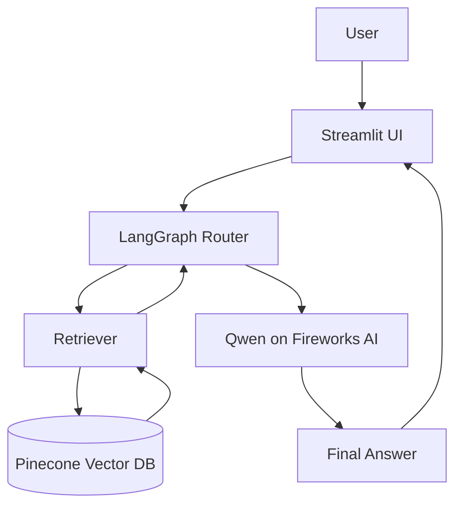
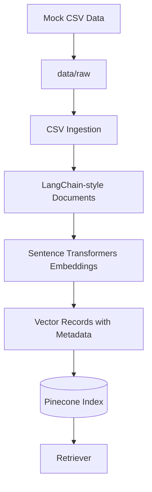

# Architecture

This document describes the main runtime flow and data ingestion pipeline for AI Product Intelligence Copilot.

## Runtime Question Flow

The Streamlit app accepts a product strategy question and calls the LangGraph workflow. LangGraph routes the question, retrieves relevant evidence from Pinecone, sends the grounded context to Qwen on Fireworks AI, and returns a structured final answer with sources.

## Data Ingestion Pipeline

The ingestion pipeline starts with generated B2B SaaS CSV datasets. Each row is converted into a document with readable text and metadata such as source type, product area, severity or priority, date, and ID. The documents are embedded with `BAAI/bge-small-en-v1.5` and uploaded to Pinecone for retrieval.
